<div align="center">

# deck

**A handheld ham-radio RX machine for SDR cyberdecks.**

Fullscreen touch GUI · RTL-SDR & Airspy HF+ · NFM / WFM / AM / SSB / DMR / YSF / D-STAR / NXDN / P25 / M17 / POCSAG / APRS / RTTY / ADS-B · scanner · waterfall · noise reduction · recording · works entirely offline

[](https://github.com/nemanjan00/deck/actions/workflows/ci.yml)


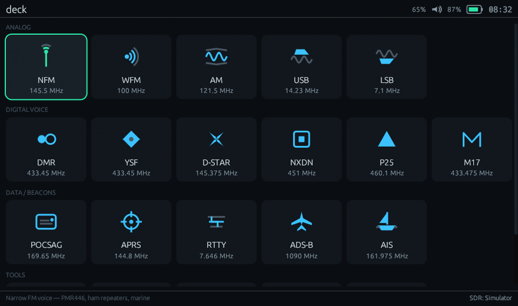

</div>

---

deck turns a small Linux handheld — Hackberry Pi CM5, Mecha Comet, Flipper-class
devices, Cardputer Zero, or any laptop — into a dedicated wideband receiver.
It **owns the SDR**: one source process streams raw IQ into deck, which tunes,
decimates and demodulates internally, then feeds demodulated audio to the
speaker and to proven external decoders (`dsd-neo`, `multimon-ng`,
`minimodem`). Only ADS-B runs as its own pipeline (`dump1090` — or anything
else that serves SBS on port 30003, including `readsb` and `rtl1090`).

Everything works with **arrows + OK + Back** (Flipper-style d-pad), and
everything is **touch-first**: tap a digit and spin it like a tuning wheel,
drag the waterfall to retune, 44 px+ targets throughout.

## Screens

| RX with spectrum + DSP chain | DMR call card (slot · CC · TG · RID) |
|---|---|
| 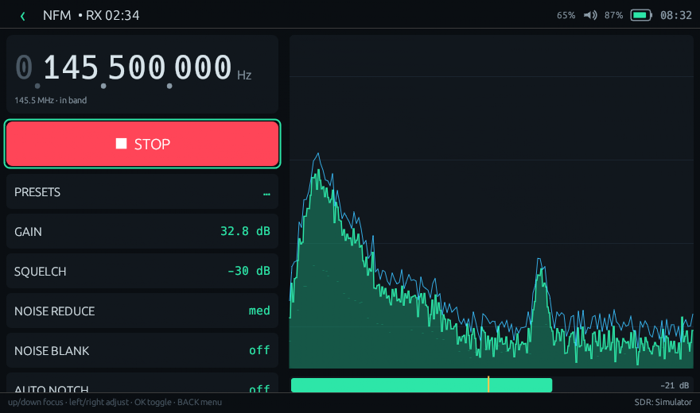 | 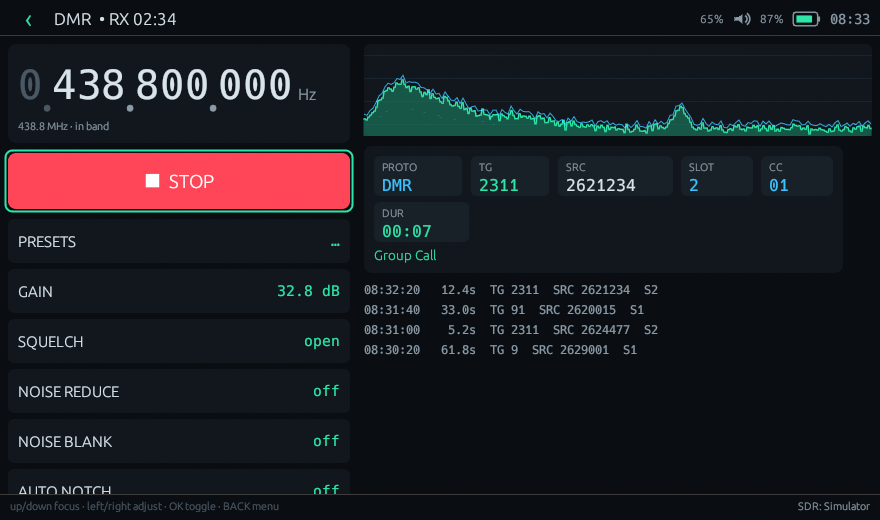 |

| RF waterfall — peak browser, drag to tune, hand-off | Channel scanner with lockouts |
|---|---|
| 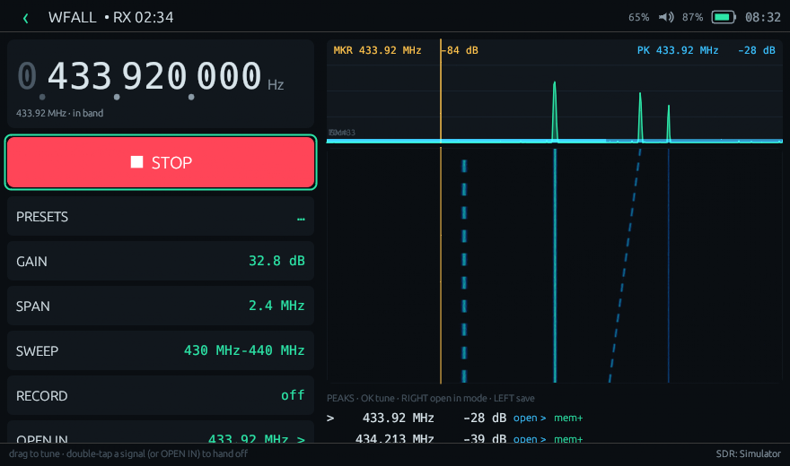 | 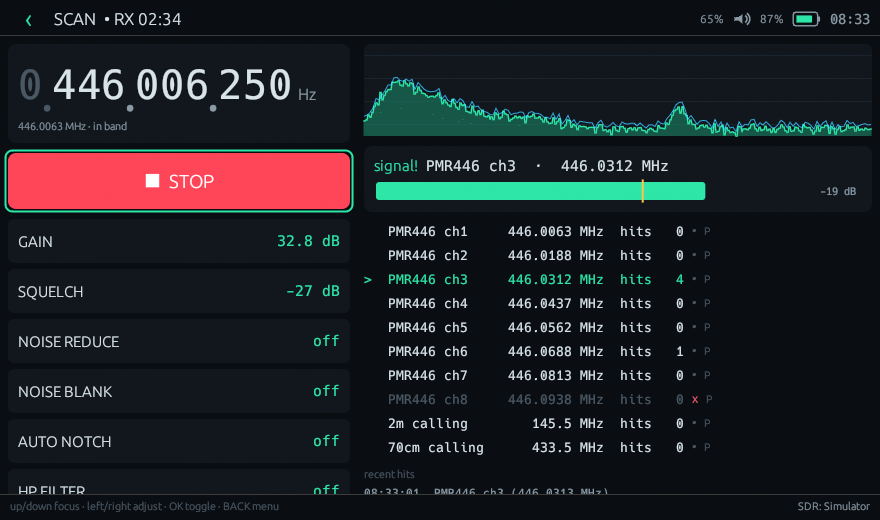 |

| POCSAG pager feed | ADS-B offline radar (table view too) |
|---|---|
| 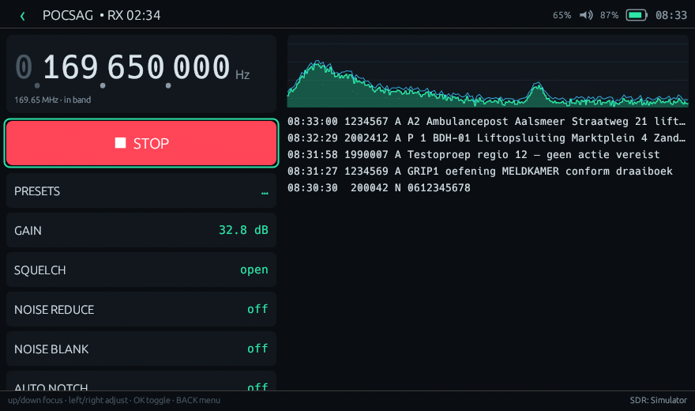 | 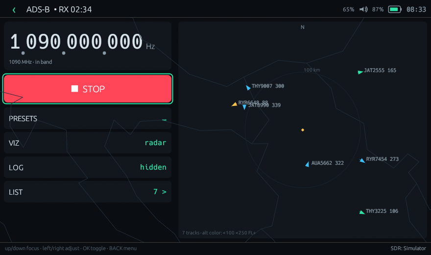 |

<details>
<summary><b>Light theme & square handhelds (tap to expand)</b></summary>

| Light theme | 480×480 (Hackberry/Mecha class) |
|---|---|
| 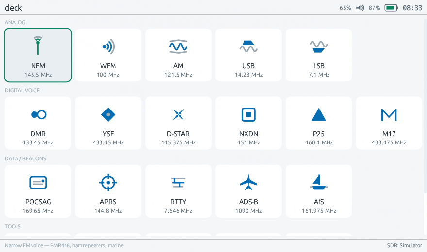 | 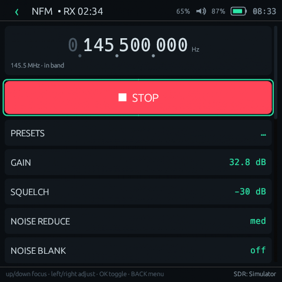 |

| Light RX | Square menu |
|---|---|
| 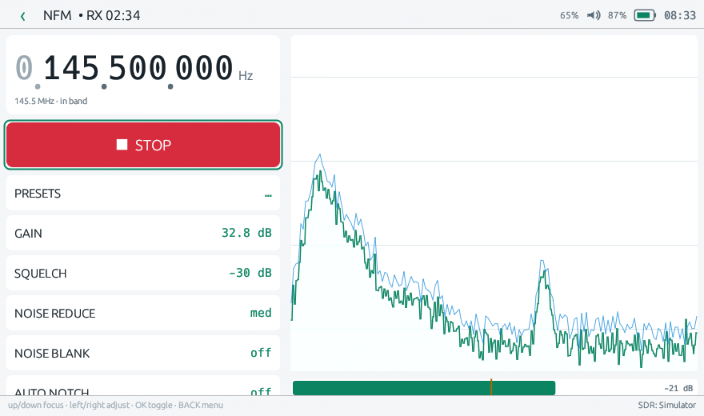 | 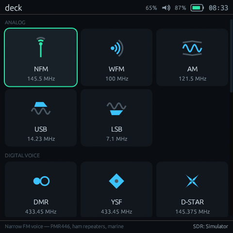 |

| ADS-B table view | AIS ships on the radar |
|---|---|
| 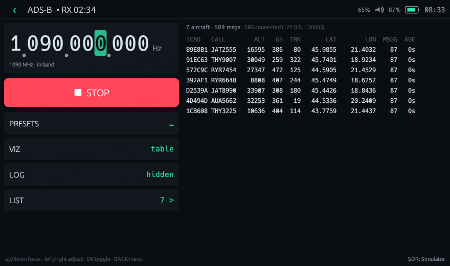 | 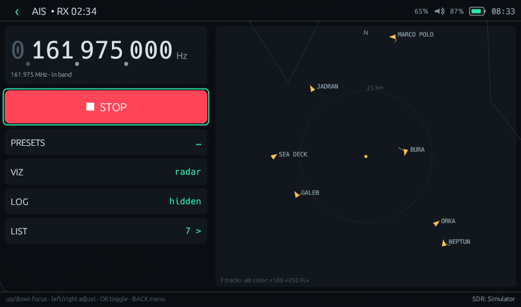 |

</details>

*Every screenshot above was rendered by `deck shot` — deck's built-in CPU
rasterizer that draws the real UI headlessly. No GPU, no display, no mockups.*

## How it works

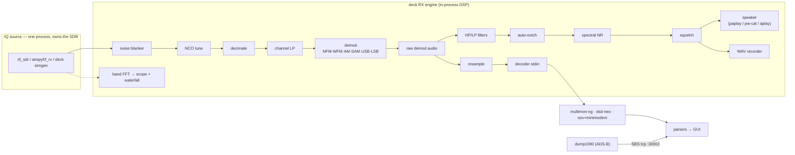

Instant retunes: moving inside the captured band (±1.2 MHz on RTL-SDR) is an
atomic NCO swap — this is what makes the scanner fast. Crossing the band edge
restarts the source on a new center, and deck *waits* for the USB device to be
released first, so nothing ever fights over the radio.

## Modes

| | modes | decoder | notes |
|---|---|---|---|
| **Analog** | NFM · WFM · AM · USB · LSB | — (built-in demod) | AM has envelope **and** synchronous (SAM) detectors |
| **Digital voice** | DMR · YSF · D-STAR · NXDN · P25 · M17 | `dsd-neo` | live call card: TG, SRC, slot, color code, NAC/RAN |
| **Data** | POCSAG · APRS | `multimon-ng` | typed message tables with detail popups |
| | RTTY | `sox` + `minimodem` | 45.45 Bd Baudot text feed |
| | ADS-B | `dump1090` / `readsb` / `rtl1090` | offline radar map + aircraft table via SBS :30003 |
| | AIS | `rtl_ais` | ships on the same radar/table (161.975/162.025 MHz) |
| **Tools** | Scanner | — | dwell/hold/lockout, priority channel, hit counters |
| | Waterfall | — | full-band scope, drag-to-tune, click-to-jump |

**Devices:** RTL-SDR (24–1766 MHz), Airspy HF+ (9 kHz–31 MHz, 60–260 MHz)
and HackRF One (1 MHz–6 GHz, cs8) are autodetected over sysfs — no udev fights, no libusb linkage. A
**Simulator** device is always present (see below). Range checks are
per-device: deck won't let you ask an HF+ for 1090 MHz.

## The DSP toolkit

All on the monitor path, all adjustable live, all persisted per mode:

- **Spectral NR** — FFT noise-floor tracking + over-subtraction (3 levels)
- **Noise blanker** — IQ-domain impulse killer (ignition/power-line pops)
- **Auto-notch** — LMS adaptive filter; heterodyne whistles just vanish
- **HP/LP filters** — biquad cascades, 24 dB/oct, cutoff ladders
- **Squelch** — RMS with hysteresis, S-meter with threshold marker
- **AM sync detector** — PLL-based SAM for fading shortwave
- **CTCSS tone squelch** — 38-tone detector; the live tone shows as a chip,
  pick one and the gate requires it (DCS not implemented)
- **IF shift** — ±800 Hz passband tuning on SSB, pitch-preserving

**Waterfall as launchpad:** deck auto-detects **peaks** in the band (noise-floor
tracking, DC-spike filtered) and lists them under the fall — tap one to tune,
or hand it straight off to any mode (`OPEN IN` / double-tap) and RX starts
there. SPAN zooms 2.4 MHz → 300 kHz around the marker, with KC908-style
MKR/PK level readouts (calibratable via `[sdr] cal_db`), a **band-plan
overlay** (ham/broadcast/air/marine/ISM strips), **SWEEP**
(search-between-limits: marches across `[sweep] from..to` and fills the peak
browser with everything it finds), and REC captures **raw IQ**
(.cu8/.cs16 + sidecar). Any frequency can be saved as a **memory channel**
(starred in the preset picker, persisted) — including straight from the peak
list (`mem+`), KC908 search-and-store style.

**ADS-B & AIS radar:** a fully offline radar view with real geography —
Natural Earth coastlines/borders are compiled in (68 KB, public domain) —
range rings around your `[adsb] lat/lon` home (or auto-centered), track-
rotated arrows (altitude-colored for aircraft), position trails. AIS ships
ride the same radar and table.

**Trunk following (experimental):** while a digital-voice mode runs, deck
serves rigctl on `127.0.0.1:4532`; add `-U 4532` to your dsd-neo decoder
override and its trunking engine drives deck's tuner — in-band hops are
instant NCO swaps. The
scanner also honors a **priority channel** (revisited every few hops), and
**F12** drops an in-app screenshot into `~/Music/deck/screens/` for field
logging.

Decoders always receive the *raw* demodulated audio — your listening comfort
never degrades the decode.

**Recording:** one tap writes timestamped WAVs (48 kHz mono) of what you hear.
Squelch-aware — closed-gate static isn't written, so scanner recordings stay
compact. Files land in `~/Music/deck/` (configurable).

## No radio? No problem

The **Simulator** device synthesizes an entire populated RF band — NBFM voice
babble, real POCSAG bursts (correct BCH codewords), real AX.25/AFSK packets,
Baudot RTTY, AM/SSB/WFM stations, drifting carriers — and pushes it through
the *same* RX chain and the *same* real decoders. Digital voice and ADS-B are
simulated at the decoded-line level.

The generator is also a standalone tool:

```sh
deck simgen --mode iq-band --profile pocsag --format cu8 --rate 2400000 > band.iq
deck simgen --mode aprs --count 3 --fast | multimon-ng -t raw -a AFSK1200 -
deck simgen --mode adsb --lines            # SBS feed on stdout
```

And `deck doctor --selftest` pipes sim signals through your *installed*
decoders and verifies the decodes come back — an end-to-end health check of
the whole receive path.

## Install

**Runtime tools** (install what you need; deck's Doctor screen shows what's
missing and which modes it unlocks):

| distro | command |
|---|---|
| Arch | `pacman -S rtl-sdr airspyhf hackrf multimon-ng sox minimodem dump1090 rtl_ais libpulse` |
| Debian/Ubuntu/Pi OS | `apt install rtl-sdr airspyhf multimon-ng sox minimodem dump1090-fa pulseaudio-utils` |
| dsd-neo | build from [arancormonk/dsd-neo](https://github.com/arancormonk/dsd-neo) (digital voice) |

**deck itself** — grab a release binary (x86_64 / aarch64), or:

```sh
cargo build --release          # needs Rust 1.79+
./target/release/deck          # fullscreen GUI
./target/release/deck --windowed   # desktop window for testing
```

No GPU required beyond basic GL/GLES (every Pi-class device qualifies). deck
is fully offline: no telemetry, no network use except your own localhost SBS
port.

## Controls

Everything works with the d-pad alone; touch and letters are shortcuts.

| input | action |
|---|---|
| **arrows / hjkl** | move focus · adjust the focused control |
| **OK / Enter / Space** | activate, toggle, start/stop RX |
| **Back / Esc** | leave edit mode → back → power menu |
| digits `0-9` | type a frequency directly |
| **T** | dark ↔ light theme |
| **, . M** | volume down / up / mute (system mixer) |
| **F11** | toggle fullscreen |
| *touch* | tap a tuner digit, drag it like a wheel; drag the waterfall to tune; tap rows for detail |

The frequency tuner is per-digit: select a digit, spin it — and while the
tuner has focus, the viz becomes the RF band scope so you tune against real
signals. On the menu, Esc
opens the power menu (suspend / reboot / power off via logind) — deck is meant
to *be* the device UI.

## Configuration

```sh
deck config --write      # create ~/.config/deck/config.toml with comments
deck doctor              # devices, tools, per-mode support matrix
```

Everything has defaults; the config can override audio sink, scanner channel
lists, frequency presets, decoder commands and the IQ source templates
(placeholders: `{device} {freq_hz} {center_hz} {gain} {ppm} {rate} …`).
State (last frequency, gain, NR/NB/notch/filters, squelch, theme, lockouts)
persists automatically per mode.

**ADS-B via anything:** deck consumes BaseStation/SBS from
`127.0.0.1:30003`, so `dump1090`, `readsb`, or even `rtl1090` under wine are
interchangeable — point `[pipelines.rtlsdr] adsb = "…"` at whichever you run.

## Hacking

- [docs/ARCHITECTURE.md](docs/ARCHITECTURE.md) — module map, invariants, data flow
- [docs/ADDING_MODES.md](docs/ADDING_MODES.md) — add a new mode in four steps
- [docs/STATUS.md](docs/STATUS.md) — current state, caveats, roadmap
- `cargo test` — 65 tests: DSP correctness (demods recover known tones, NR
  provably improves SNR), encoder round-trips (POCSAG BCH, AX.25 CRC/HDLC,
  Baudot), parsers, plan resolution
- `deck shot` — renders every screen headlessly; CI-friendly UI smoke test

### Known caveats

- `airspyhf_rx` builds vary in flags/output format — the IQ source template is
  config-overridable; Doctor shows the resolved command.
- dsd-neo frame flags follow DSD-FME conventions (`-fs -fy -fd -fi -f1 -fz`);
  verify against your build, override per mode in `[decoders]`.
- WFM is mono for now. Scanner hops across band edges cost a source restart
  (~0.3–0.5 s); in-band hops are instant.

## Roadmap

Stereo WFM (pilot decode) · DCS squelch · absolute dBµV calibration tables ·
Airspy R2/Mini (needs fractional-rate decimation) · more SDRs (teach
`device.rs::USB_IDS` + an IQ source template)

## License

MIT. deck stands on excellent shoulders: [egui](https://github.com/emilk/egui),
[rustfft](https://github.com/ejmahler/RustFFT),
[dsd-neo](https://github.com/arancormonk/dsd-neo),
[multimon-ng](https://github.com/EliasOenal/multimon-ng),
[dump1090](https://github.com/flightaware/dump1090),
[rtl-sdr](https://osmocom.org/projects/rtl-sdr),
[airspyhf](https://github.com/airspy/airspyhf),
[minimodem](http://www.whence.com/minimodem/) — thank you.
